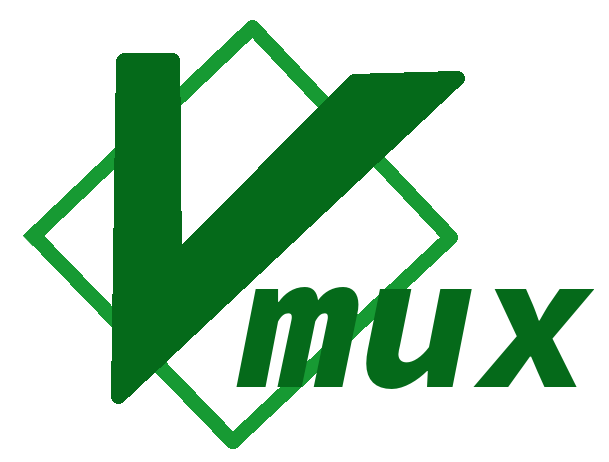

Helper to use neovim as a terminal multiplexer.

## Installation
First, you need to install [abduco](https://github.com/martanne/abduco) and [nvr](https://github.com/mhinz/neovim-remote).

With packer:
```lua
use 'klapacz/vmux'
```

Then add the following to end of your .zshrc:
```zsh
source ~/.local/share/nvim/site/pack/packer/start/vmux/setup.sh
```

## Usage
```
vmux new asdf
vmux attach asdf
vmux list
vmux send asdf path/to/file
```

## Detaching
You can detach from the session with ^g

